# Airlock Browser User Guide
#### For Version 2.0, Android

[Download as PDF](AirlockBrowserVersion2UserGuide.pdf)

## Table of Contents

[//]: # (TOC Begin)
* [Introduction](#introduction)
* [Overview of the User Interface](#overview-of-the-user-interface)
* [Configuring General Settings](#configuring-general-settings)
	* [Language](#language)
	* [Search Using](#search-using)
	* [Screen Mode at Startup](#screen-mode-at-startup)
	* [Hardware Back Button Action](#hardware-back-button-action)
	* [Show Launchpad when App Starts](#show-launchpad-when-app-starts)
	* [Pause Browser Tab when Inactive](#pause-browser-tab-when-inactive)
	* [Show Orientation Lock](#show-orientation-lock)
	* [Download Images](#download-images)
	* [Ad Blocker](#ad-blocker)
* [Configuring Security Settings](#configuring-security-settings)
	* [Prevent App Exit](#prevent-app-exit)
	* [Require Passcode at Launch](#require-passcode-at-launch)
	* [Unlock using Fingerprint Reader](#unlock-using-fingerprint-reader)
	* [Restore Tabs at Startup](#restore-tabs-at-startup)
	* [Allow Access to My Location](#allow-access-to-my-location)
	* [Add Shared Content to History](#add-shared-content-to-history)
	* [Enable Incognito Mode at Start-Up](#enable-incognito-mode-at-start-up)
	* [Save Passwords for Web Pages](#save-passwords-for-web-pages)
	* [Delete Saved Passwords](#delete-saved-passwords)
	* [Delete Cookies](#delete-cookies)
	* [URL Rules](#url-rules)
* [Customizing the Browser's Appearance](#customizing-the-browsers-appearance)
	* [Customizing Menus and Toolbars](#customizing-menus-and-toolbars)
	* [Night Dimmer Level](#night-dimmer-level)
	* [Launchpad Background](#launchpad-background)
	* [Styling the App with a Custom Theme](#styling-the-app-with-a-custom-theme)
* [Using the Device Settings tab](#using-the-device-settings-tab)
	* [Configuration File URL](#configuration-file-url)
	* [Importing Configuration with MDM Software](#importing-configuration-with-mdm-software)
	* [License Server API Key](#license-server-api-key)
	* [Configuring Device Vendor Specific Settings](#configuring-device-vendor-specific-settings)
* [Configuring Lock-Down Mode with the Administration Screen](#configuring-lock-down-mode-with-the-administration-screen)
* [Creating a Web Application Profile](#creating-a-web-application-profile)
	* [Invoking Custom JavaScript](#invoking-custom-javascript)
	* [Using JavaScript Templates](#using-javascript-templates)
	* [Handling Barcode Scan Events](#handling-barcode-scan-events)
* [Adding Client-Side CSS to Pages](#adding-client-side-css-to-pages)
	* [Applying a Custom User Agent](#applying-a-custom-user-agent)
	* [Limiting Screen Rotation](#limiting-screen-rotation)
	* [Improving Text Readability](#improving-text-readability)
	* [Inserting Scanned Text into a Field](#inserting-scanned-text-into-a-field)
* [Allowing Legacy Pages to Launch Popups in the Same Tab](#allowing-legacy-pages-to-launch-popups-in-the-same-tab)
* [Interacting with the Browser via On-Page JavaScript](#interacting-with-the-browser-via-on-page-javascript)
* [Using the History Screen](#using-the-history-screen)
* [Creating and Editing Bookmarks](#creating-and-editing-bookmarks)

[//]: # (TOC End)

## Introduction

Airlock Browser is a modern, feature rich, highly configurable web browser that allows mobile workers to be more productive. It has been specifically designed for ruggedized devices and is based on the popular Surfy Browser for Windows 10 and Android. Airlock Browser includes all the features you'd expect in an industrial browser such as hardware barcode reader support, client side JavaScript and CSS execution, URL rules, and remote configuration; as well as some distinctive features, such as passcode and fingerprint access, text to speech, and a fully customizable user interface.

This guide provides information on the usage and configuration of Airlock Browser, and also on developing web-based applications for Airlock Browser.

Airlock Browser for Android is compatible with devices running Android 5.0 (Lollipop) and above.

## Overview of the User Interface

When launching Airlock Browser, the launchpad is displayed. The launchpad contains tiles, which are quick links to web application profiles that you create. (See Figure 1.) You look at creating web application profiles later in the guide.

Tapping or sliding the launchpad to the left reveals the web content. By tapping the ellipsis button in the bottom right hand corner of the main view, the application bar expands.

There is an address bar, and various toolbar and menu items. Tapping the address bar allows you to enter a URL or a search query.

> **NOTE:** The buttons and menu items in the application bar and tab menu are completely customizable. A device administrator may re-order, remove, or add buttons according to requirements. You see how to achieve this later in this guide.

<figure>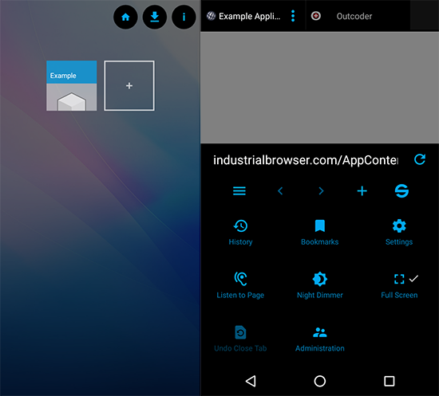<figcaption>Figure 1. Launchpad and Tabbed Browser side-by-side</figcaption></figure>

When the application bar is expanded, the tab headers are revealed at the top of the screen. You can switch between tabs by scrolling and tapping the desired tab. A favicon image for the page sits in each tab along with the page title and an SSL indicator that notifies the user of an secure SSL connection. A vertical ellipsis button reveals a set of commands available for the active tab. (See Figure 2.)

<figure>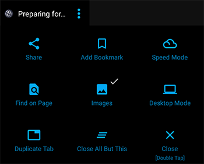<figcaption>Figure 2. Browser Tab Menu</figcaption></figure>

Tapping the Settings button in the application bar menu, displays the Settings screen. (See Figure 3.)

> **NOTE:** All settings are exportable, as are web application profiles. You explore how to export the browser's configuration, and even host the exported configuration on a server, to deliver browser settings to multiple devices. 

The Settings screen  offers various settings, and is divided into four sections:
* General Settings
* Security Settings
* Appearance Settings
* Device Settings

<figure>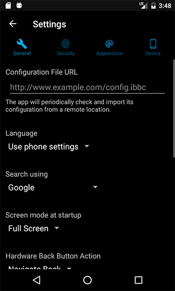<figcaption>Figure 3. Settings Screen</figcaption></figure>

> **NOTE:** When first launching Airlock Browser, the app is in its non-locked-down state. All screens are visible, all settings are present on the Settings screen, and launchpad tiles are editable. However, upon setting an administration password, most settings are hidden on the Settings screen, launchpad tiles are no longer editable, and the screens available to the user are limited to those that you (as the administrator) allow in the application bar. You can decide which items, if any, are appropriate for your organization's needs and should appear in the application bar and tab menu. We explore these aspects later in this guide.

## Configuring General Settings
In this section you explore the items in the General section of the Settings screen.

### Language
By default Airlock Browser selects its user interface language according to the devices language setting. You can, however, configure the language independently, which enables administration of the device to be performed in one language, while providing Airlock Browser's interface to users of another language. 

### Search Using
When you enter text into Airlock Browser's address bar, if the text is unable to be converted to a URL, Airlock Browser performs a search using the specified search provider.

> **NOTE:** Selecting the *none* option, from the *Search using* drop down box, disables the address bar search feature.

### Screen Mode at Startup
By default, Airlock Browser launches in full-screen mode; hiding the application bar and tab headers. Set the option to *Normal* to have the application bar and tab headers displayed at launch.

> **NOTE:** The user is able to enable or disable full-screen mode using the *Full Screen* item in the application bar menu. To prevent this, remove the Full Screen item from the application bar menu via the *Customize Menus* item on the Appearance tab of the Settings screen.

### Hardware Back Button Action
To perform a back navigation of a web page, the user may either use Airlock Browser's back button in its main toolbar or the user can tap the hardware back button in the operating system's navigation bar. To prevent the hardware back button from navigating to the previous web page set the *Hardware Back Button Action* to *None*.

### Show Launchpad when App Starts
When Airlock Browser launches or is deactivated for 5 minutes, the launchpad is brought into view. To prevent this behavior, disable this option.

### Pause Browser Tab when Inactive
When switching between tabs, Airlock Browser does *not* stop playback of video on inactive tabs. Enable this option to prevent video playback when a tab is not the active tab.

### Show Orientation Lock
The orientation lock appears when the device is rotated, and allows the user to temporarily prevent Airlock Browser from switching from, or to, landscape or portrait mode. On some devices, where the accelerator is malfunctioning or not properly configured, the orientation lock can be displayed incorrectly. This option allows you to prevent the orientation lock from showing.

### Download Images
This option allows you to disable the downloading of images when a web page loads, which may be useful in low bandwidth environments, or when a web application presents images that have a large file size. 

### Ad Blocker
When enabled, the Ad Blocker stops most web page ads from being displayed.

## Configuring Security Settings
In this section you explore the items in the Security section of the Settings screen.

### Prevent App Exit
Ordinarily, the devices back button may be used to exit Airlock Browser. To prevent the app from exiting via the hardware back button, enable this option.

### Require Passcode at Launch
When *Require Passcode at Launch* is enabled, the user is presented with a passcode entry screen when the app launches or the app is deactivated for 5 minutes or longer. See Figure 4. This feature is commonly used when the device is being used by staff in a public or unrestricted environment. 

When Require Passcode at Launch is enabled, the window for the app is secured. This means that there is no app preview when cycling through apps, and taking a screenshot of the app is disabled.

> **NOTE:** The passcode **is** included in the exported configuration in an encrypted format. Thus, you are able to control the passcode for multiple devices using a hosted configuration file. 

When you set a passcode for the browser, the Require Passcode at Launch is automatically enabled. You can, however, disable Require Passcode at Launch after a passcode is set.

> **NOTE:** Do not confuse the Administration password with the passcode. The Administration password, set on the Administration screen, limits access to authorized administrators only. While the passcode limits access to authorized users only.

<figure>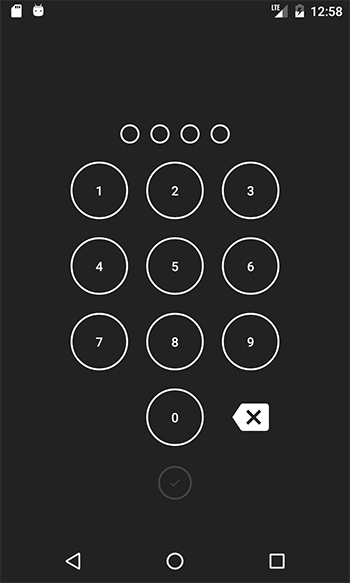<figcaption>Figure 4. Passcode Entry Screen</figcaption></figure>

### Unlock using Fingerprint Reader
If the device has a hardware fingerprint reader, then Airlock Browser can be unlocked using a fingerprint, without requiring the user to enter the passcode.

> **NOTE:** A passcode must be set to use the Fingerprint Reader unlock feature.

### Restore Tabs at Startup
When enabled, this option causes Airlock Browser to re-open the pages that were open the last time it was running.

### Allow Access to My Location
Some websites rely on knowing the GPS location of the device to provide, for example, navigation services. Disabling this option prevents web pages from accessing the location of the device.

### Add Shared Content to History

When enabled, when sharing a page or image, it is added to the shared content section of the history screen.

### Enable Incognito Mode at Start-Up

Incognito mode prevents the browser from retaining the history of viewed pages. An incognito button can be placed in the application bar menu by using the menu customization option.

> **NOTE:** When incognito mode is enabled pop-up windows are disabled.

### Save Passwords for Web Pages
When enabled, the browser prompts the user to save a password when it identifies a form submission with a password field. If the user agrees to saving the password, the password is stored in an encrypted form. When the user navigates to the same page, the browser will attempt to populate the password field.

Disabling this option prevents the saving of passwords.

> **NOTE:** Web page passwords are not included when exporting the browser's configuration.

### Delete Saved Passwords
This button deletes all saved web page passwords.

### Delete Cookies
This button deletes all cookies.

### URL Rules
URL rules determine which pages can or cannot be accessed by the browser. When navigating to a URL the list is evaluated from top to bottom. (See Figure 5.)

As soon as a match is found, the *Allow* or *Deny* rule is applied. Long press to change the order of a URL rule. Swipe a URL rule left or right to delete it. If you mistakenly delete a rule, use the undo button in the application bar to restore it.
To create a new rule, tap the *+* button in the application bar.

Wildcards are supported by default. You may also specify more complex rules using [regular expressions](https://en.wikipedia.org/wiki/Regular_expression). To enable interpretation of the text as a regular expression, check the *Regular Expression* checkbox. For example, to specify URLs that belong to the example.com domain and all sub-pages you might use something like `^\s*https?://(www.)?example.com/?.*`

> **NOTE:** An allow rule is automatically created for the URL of active web application profile (defined in the Launchpad), and it takes precedence over the URL rules defined on the URL Rules screen. 

<figure>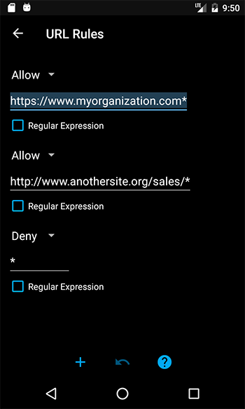<figcaption>Figure 5. URL Rules Screen</figcaption></figure>

## Customizing the Browser's Appearance
In this section you see how to change theme options and customize menu and toolbars via the Appearance section of the Settings screen.

### Customizing Menus and Toolbars
Depending on your organizations needs, you may wish to hide, show, or reorder some items in the browsers main application bar and tab menu.

The items that appear in the main application bar and tab menu are customizable. You can remove items, change their order, and even add new items.

To open the menu and toolbar editor, tap the *Customize Menus* button on the *Appearance* tab of the Settings screen.

There are three menus to choose from:
* Main Toolbar
* Main Menu
* Tab Menu

The main menu and toolbar are located together on the application bar. While the tab menu is located at the top of each browser tab. (See Figure 6.)

<figure>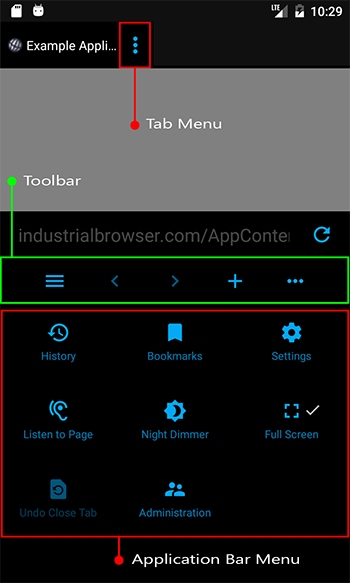<figcaption>Figure 6. Application bar menu, toolbar, and tab menu</figcaption></figure>

Choosing *Main Toolbar* from the *Select Menu* screen displays the *Main Toolbar* customization screen. (See Figure 7.)

A checkmark alongside an item indicates that it will be displayed. You can introduce new items to the toolbar, or remove items by unchecking them. Items can be reordered by long pressing and dragging the item to a new position in the list.

There are two required items that cannot be unchecked: the *Expand* button in the Main Toolbar and the *Administration* item in the Main Menu. The Expand button is required so that the user can open the application bar menu to get to the *Administration* button.

<figure>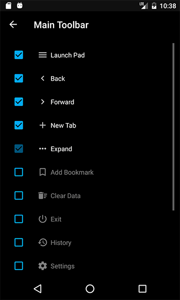<figcaption>Figure 7. Customizing the toolbar</figcaption></figure>

### Night Dimmer Level
The Night Dimmer Level setting controls the how dark the screen is when the Night Dimmer is engaged via the main application bar menu.
This setting is visible in lock-down mode to allow it to be adjusted in different lighting conditions.

### Launchpad Background

The Launchpad's background image can be replaced by an image better reflecting your organization's branding.

To select a new image, tap the existing image. A file-picker dialog is displayed. 

> **NOTE:** When exporting Airlock Browser's configuration, the Launchpad background image **is** included in the configuration. The image is optimized to limit the overall file size of the exported configuration file.

To restore the default Launchpad background image, tap the *Reset* button.

### Styling the App with a Custom Theme
The following three configurable theme colors allow you create a look to the app that better represents your organization:

* Browser Tab Background
* Application Bar Background
* and Accent Color

The three color settings also determine the appearance of other UI elements within the app, such as dialog boxes, screen backgrounds, and buttons.

The Browser Tab Background setting determines the theme type of the app. If Browser Tab Background is set to a light color (such as white or yellow), the app adopts a light theme. While a dark tone, results in a dark theme. If a light theme is in place, screen and dialog boxes are white and text is gray. Conversely, a dark theme causes dark backgrounds and white text.

> **NOTE:** Airlock Browser attempts to ensure that text is always readable. For example, if you select a light color (such as white) as your Browser Tab Background, the text color is switched to gray. 

> **NOTE:** Selecting white as both the *Accent Color* and the *Application Bar Background* causes the browsers default accent color to be used in some parts of the user interface, where readability would be otherwise compromised.

## Using the Device Settings tab

In this section you explore the items on the Device tab of the Settings screen.

### Configuration File URL
Airlock Browser can be configured remotely using an exported configuration file. The file is hosted on a server and can be used to configure multiple devices. We discuss this in greater detail in the following section: *Configuring Lock-Down Mode with the Administration Screen*  

Changing the Configuration File URL causes the browser to immediately attempt to download the configuration file and import the configuration. If configuration importation succeeds, a success message is displayed.

### Importing Configuration with MDM Software

When Airlock Browser is launched, and periodically thereafter, the browser automatically looks for a configuration file located at *'&lt;External Directory&gt;/Enterprise/Browser/Config.brs'*. If the *Configuration File URL* setting has not been modified in the app's setting screen, then the *Config.brs* is automatically applied. By deploying this file using your MDM solution, you can easily configure multiple devices without needing to manually make any changes to your devices. In addition, a different *Configuration File URL* setting may be present in the imported *Config.brs* file. This allows you to instruct Airlock Browser to download its configuration file from a different location from then on.

Before Airlock Browser imports a configuration file it first verifies that the file's last modified date is more recent than the date of the last import. If it is not, the configuration file is *not* automatically imported.

> **NOTE:** Settings from an imported configuration file override any local settings applied using the settings screen.

### License Server API Key

The License Server API Key is a value that is assigned to you by Outcoder or a third-party representative. This key allows you to assign, unassign, and reassign licenses for devices within your organization. All devices in your organization should have the same License Server API Key.

You can set the value directly, using the License Server API Key field. Or, you can set this value by placing the key in a file on the device. 

The file must be named *ApiKey.txt* and must have the following path:
[External Storage Directory]/Enterprise/Browser/ApiKey.txt

> **TIP:** You can find the location of the external storage directory by browsing to the [IO example page](../../Scripting/V2/Samples/IO/#testGetKnowDirectoriesText) on your device, and using the *Get External Directory* button.

Once you procure a license for Airlock Browser, there are two ways to apply the license. The first, is to automatically have the license applied by setting the correct License Server API Key on each device. You can then manage and distribute purchased licenses using the [Outcoder License Manager](../../../LicenseManager/V2/UserGuide/).

Alternatively, if your device does not have internet access, you can manually import the license using the Import License button in Administration -> Manage License. 

### Configuring Device Vendor Specific Settings
Airlock Browser allows configuration of vendor specific settings for devices manufactured by Bluebird, CipherLab, Honeywell, Panasonic, and Zebra. Different device types offer different options for their hardware. 

When Airlock Browser is running on a supported device from any of the above manufacturers, the *Vendor Configurations* button on the *Device* tab of the Settings screen takes you to the device configuration specific to the device type. However, when running Airlock Browser on a device such as a tablet that is not manufactured by one of the above manufactures, tapping *Vendor Configurations* from the *Device* tab of the Settings screen displays a list of device vendors; allowing you to configure multiple device vendor configurations, and allowing you to support multiple device types within the one exported configuration file. (See Figure 8.)

> **TIP:** An alternate way to create a configuration supporting multiple device vendors, is to export the configuration from one device manufacturer and import it to a device from another manufacturer. You can then configure the device from the second manufacturer, while still retaining the configuration for the first.

The list of available settings varies for each of the vendor device types.

The Device Configuration screen uses a tabbed interface. You can tap the tab header or swipe to switch between configuration categories.

> **NOTE:** Multiple vendor specific configuration may be configured on the device. The correct vendor configuration is applied automatically depending on the device. In this way, you are able to support multiple device vendors using the same configuration file.

<figure>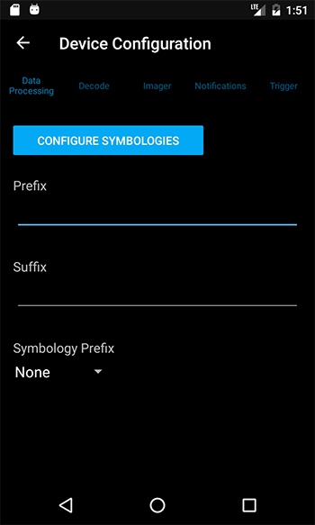<figcaption>Figure 8. Device Configuration screen</figcaption></figure>

Configure barcode symbologies by tapping the *Barcode Symbologies* button. A list of supported symbologies is displayed. (See Figure 9.)

It may improve barcode scanning performance to disable those symbologies that will not be needed. Tap on a symbology to configure it.

> **NOTE:** For information regarding each vendor specific setting, including barcode symbologies, please see the documentation supplied by the vendor.

<figure>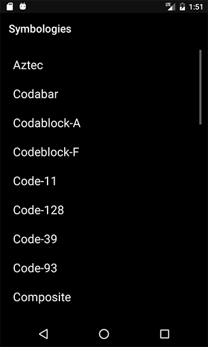<figcaption>Figure 9. Symbology Selection screen</figcaption></figure>

Each symbology may be enabled or disabled. (See Figure 10.)
When a symbology is disabled it appears dimmed-out in the Symbology Selection screen. 

<figure>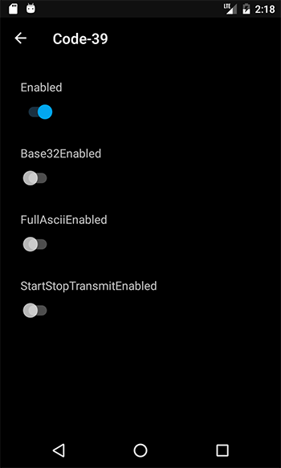<figcaption>Figure 10. Symbology screen</figcaption></figure>

Vendor device configurations *are* included in the exported configuration file.

## Configuring Lock-Down Mode with the Administration Screen

The Administration Screen provides a step-by-step guide on how to set up the browser for your organization. (See Figure 11.)  

The first two steps direct you to create application profiles on the *Launchpad* and to configure the app via the *Settings* screen.

Step 3, *Set a configuration password* is important because, once set, Airlock Browser will require the user to enter the password to access the Administration screen. Other parts of the application are also placed in lock-down mode, such as the Settings screen; which displays only a subset of the settings. 

> **NOTE:** You may also decide to disable the *Settings* menu item in the application bar. In this case, the only way to open the Settings screen is via the Administration screen after entering the configuration password.

The final step, 'Export the configuration' saves the settings and web profiles to a file. The configuration file can then be imported to another device using the 'Import Configuration' item on the Administration screen. Alternatively, the configuration file can be hosted on a web server and automatically imported using the 'Configuration file URL' option on the Device tab of the Settings screen.

If you specify the 'Configuration file URL' option, Airlock Browser periodically checks for an updated configuration and automatically imports the configuration; thereby allowing you to easily configure multiple devices at once.

<figure>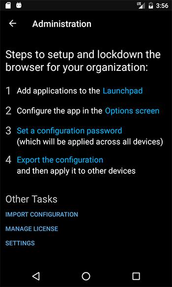<figcaption>Figure 11. Administration Screen</figcaption></figure>

Tapping the Manage License item displays the Manage License screen. (See Figure 12.)

> **NOTE:** The Manage License screen is used to manually import a license and is designed for scenarios where internet access is not available. The preferred method for applying licenses is with the [Licium License Manager](http://www.outcoder.com/Products/LicenseManager/). The Licium License Manager (LLM) provides an easy way to distribute licenses for Outcoder products such as Airlock Browser. LLM allows you to assign, revoke, or reassign licenses to devices within your organisation.
In addition, it provides you with a bird's eye view of products installed on devices within your organisation, and gives you back control over license distribution.

The Manage License screen allows you to export the serial number of the product, which can be provided to Outcoder or your supplier to procure a license. You can use the Save button, to save the serial number to a file. The *Copy* button copies the serial to the devices clipboard. While the *Share* button allows you to select another app, such as an email client, to send the serial number to yourself or a third-party.

Once a license has been procured, you can import the license using the *Import* item on the Manage License screen.

<figure>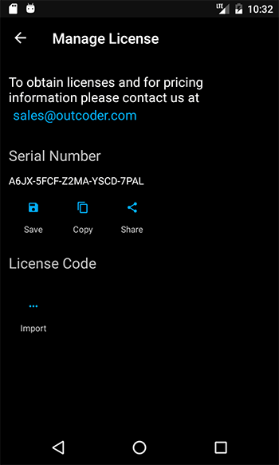<figcaption>Figure 12. Manage License Screen</figcaption></figure>

## Creating a Web Application Profile
Web application profiles (AKA applications) represent web sites. They allow you to define the behavior of Airlock Browser when navigating to pages within your organization. Each application is represented as a tile on the launchpad. Tapping on a tile applies the settings for that application and opens the Web Address in a new browser tab. 

To create a new web application profile, tap the + tile on the launchpad. (See Figure 13.)

The Web Address edit box defaults to the URL of the current active tab.

To edit an existing web application profile, long press its tile in the launchpad. A menu appears allowing you to edit the tile or delete the tile. When a tile is deleted from the applications section in the launchpad, it is deleted from the device.

The web application profile includes a *Title* field, the *Web Address* (URL), a tile color option, and several other options that we now explore.

<figure>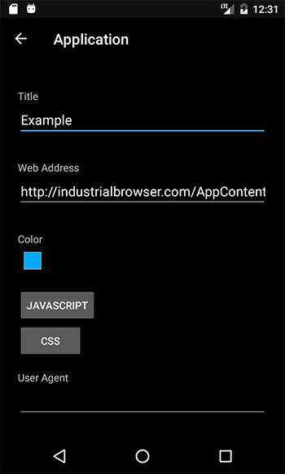<figcaption>Figure 13. Web Application Profile Screen</figcaption></figure>

### Invoking Custom JavaScript
The Web Application Profile *JavaScript* option allows you to edit or create JavaScript that is executed when, for example, the web page loads or when a barcode scan occurs.

> **NOTE:** For in-depth coverage of Airlock Browser's JavaScript APIs, please see the [Programming Guide](ProgrammingGuide/)

The list of JavaScript items is presented on the JavaScript screen. (See Figure 14.) Each item displays the title of the script and the event when the JavaScript is invoked on the web page.

New JavaScript items are created using the *+* button in the application bar. To delete a JavaScript item, swipe it left or right. If you mistakenly delete an item, use the undo button in the application bar to restore it.

<figure>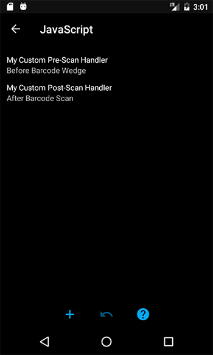<figcaption>Figure 14. JavaScript List</figcaption></figure>

Tapping a JavaScript item displays the JavaScript editor. (See Figure 15.)

The following are the three available execution events:
* On Page Load
* Before Barcode Wedge
* After Barcode Scan
* Append to body

If *On Page Load* is selected, the script is invoked on the web page as soon as the page has loaded.

If *Before Barcode Wedge* is selected, the script is invoked before text is inserted into a field.

> **NOTE:** When *Before Barcode Wedge* is selected, the *Keyboard Wedge* option must be enabled in the Web Application Profile settings for the script to be invoked.

> **NOTE:** To receive a notification when a barcode scan occurs, you can also use the *On Page Load* option to subscribe to the `airlock.scanning.onScan` event. The `onScan` event is described later in this guide.

If *After Barcode Scan* is selected, the script is invoked after a barcode scan is performed, regardless of the *Keyboard Wedge* option in the Web Application Profile settings.

If *Append to body* is selected, the script is not invoked but added directly to the body of the html page.

JavaScript may be entered directly into the JavaScript field. Alternatively, use the Import button in the application bar to browse for a JavaScript file. This allows you to edit the file with the convenience of a desktop editor. 

When importing a file, you are given the option to append its content to the JavaScript field or replace the content in the JavaScript field.

<figure>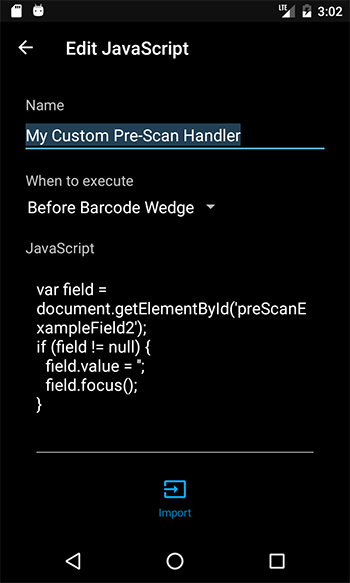<figcaption>Figure 15. JavaScript Editor</figcaption></figure>


### Using JavaScript Templates
When you create a New JavaScript item, you have the option to select one of the following JavaScript templates:
* Blank
* Barcode Scan
* Speech
* Print
* Load External Script


#### Barcode Scan
```javascript
var barcode = scanArgs.barcodeText;
var symbology = scanArgs.nativeSymbologyId;
/* By changing the text property you change what is inserted into a field. */
scanArgs.text = symbology + ", " + barcode + ", " + barcode.length;
/* Please see the documentation for ScanEventArgs field information. *
```

#### Speech
```javascript
airlock.speech.speakText("Hi from Airlock Browser");
```
#### Print
```javascript
airlock.printing.printPage();
```
#### Load External Script
```javascript
function loadExternalScript(url) {
    var script = document.createElement('script');
    script.src = url;
    script.type = 'text/javascript';
    script.onload = function () {
        /* console.log('Script loaded successfully.'); */
    };
    script.onerror = function () {
        /* console.error('Error loading script.'); */
    };
    document.head.appendChild(script);
}
/* Call the function with the network path or URL to the external script. */
```


### Handling Barcode Scan Events

Barcode data is provided as an immutable object to client-side JavaScript. The variable is named *scanData* and has the following fields:
* `BarcodeData`  
A string representing the barcode value.
* `SourceScanner`  
The ID of the scanner. E.g. 'Internal Image Scanner'
* `Symbology`  
The recognized symbology. E.g. Ean8
* `Timestamp`  
A string indicating when the scan occurred.
* `BarcodeLength`  
The number of characters present in the barcode data.
* `KeyboardWedgeEnabled`  
Indicates whether the currently active field is to be populated with the barcode data.
* `InsertMode`  
If the keyboard wedge is enabled, this field indicates if the barcode data will replace or be prepended or appended to the active text field.

## Adding Client-Side CSS to Pages
If you have a legacy web application that was not designed for a mobile device, you may apply custom CSS to the page to improve its appearance and usability. Tap the *CSS* button on the Web Application Profile screen to display the CSS editor.

When a page loads, the CSS is applied.

<figure>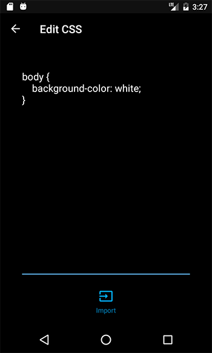<figcaption>Figure 16. CSS Editor</figcaption></figure>

### Applying a Custom User Agent
Web applications often use a device's User Agent to determine the capabilities of the device and how to render content. Sometimes it is useful to impersonate a different device to coerce the web application to render content in a particular manner. 

To achieve this in Airlock Browser, paste a custom user agent into the User Agent field. The user agent is applied for the web application profile's browser tab. Each web application profile's user agent setting is applied independently.

### Limiting Screen Rotation
In some scenarios it may make sense to limit the automatic rotation of the screen to portrait or landscape orientation. Some pages may not render well in landscape (or portrait). To lock the orientation for web application, set the *Screen Rotation* option to either *Lock Portrait* or *Lock Landscape*. By default, Screen Rotation is set to *Dynamic*, meaning that the device is free to rotate the screen depending on the orientation.

### Improving Text Readability
Sometimes web pages that were originally designed for the desktop and not for mobile devices may have text that is too small to read. To increase (or decrease) the size of the text for a page, use the *Web Page Text Size* option on the Application screen.

### Inserting Scanned Text into a Field
In Airlock Browser, when a scan completes using the hardware barcode reader, the barcode text is automatically pushed into the currently selected field of the web page. If you wish to disable this function, or if you require greater control over this capability and wish to rely solely on custom JavaScript for handling barcode events, you can disable the keyboard wedge function by setting the *Scan Population Method* option on the Application screen to `None`.

When *Scan Population Method* is set to *Set Text*, the active fields content is set to the scanned barcode text using JavaScript. When *Scan Population Method* is set to *Emulate Keyboard*, keyboard keys are emulated on the web page, simulating keyboard presses by the user.

#### Understanding Scan Insert Mode
The *Scan Insert Mode* setting allows you to control the placement of text into the active input field. If set to *Replace*, scanned barcode text replaces all content within the active input field. If set to *Prepend*, barcode text is inserted at the beginning of the active input field. *Append* sees the barcode text appended to the existing content of the active input field.

#### Prefixing and Postfixing Scanned Data
Use the *Prefix scanned data with* and *Postfix scanned data with* options to prefix and postfix the scanned data with any text.

#### Emulating Keys when a Scan Occurs
In addition to the *Prefix* and *Postfix* options, you can also emulate keyboard presses when a barcode is scanned. The *Emulate keys on scan* or *Emulate keys after scan* options allow you to define a set of space delimited key codes, which are sent to the web page as simulated key presses.

Emulating keys allows you to control, for example, navigating to a different field on the page after a scan; without requiring the use of JavaScript.

Some example key codes are: 59 for SHIFT, 61 for TAB, and 66 for ENTER.
[See here](https://stuff.mit.edu/afs/sipb/project/android/docs/reference/android/view/KeyEvent.html) for a complete list of available key codes.

The *on scan* keys are emulated before scanned text has been set or emulated; and *after scan* keys are emulated after scanned text has been set or emulated.

> **NOTE:** *Emulate keys on scan* and *Emulate keys after scan* options are independent of the *Prefix* and *Postfix* options. This is especially evident when using the *Set Text* population method. When *Emulate keys on scan* is used in combination with *Set Text*, the emulated text will be removed from the active input field.

## Allowing Legacy Pages to Launch Popups in the Same Tab
When Airlock Browser has reached its maximum number of allowed tabs (as defined in the settings), if a web page attempts to use JavaScript to open a page in a new window, Airlock Browser opens the page in the current tab. This is especially useful in lock down scenarios where the maximum number of tabs has been set to 1. To disable this behavior, set the *Tabs Exceeded Action* to *None*.

## Interacting with the Browser via On-Page JavaScript
In addition to Airlock Browsers client-side JavaScript, you can also interact with the browser using on-page JavaScript. Airlock Browser offers a JavaScript API that is consumable from web pages to respond to power events, monitor network availability, and handle barcode scanning events.

## Using the History Screen
The History screen displays a searchable list of pages URLs, grouped by day. (See Figure 17.)

To delete the history items, tap the bin icon in the application bar.

> **NOTE:** To prevent access to the History screen, uncheck the *History* item on the *Main Menu* screen, located at Settings -> Appearance -> Customize Menus -> Main Menu.

<figure>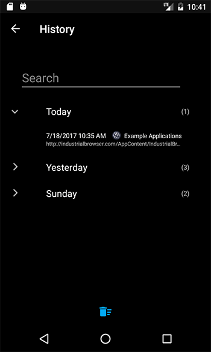<figcaption>Figure 17. History screen</figcaption></figure>

## Creating and Editing Bookmarks

The *Bookmarks* screen allows the user to edit bookmarks, delete bookmarks, and to create new bookmark folders. (See Figure 18.) Tapping a bookmark closes the Bookmarks screen and opens the bookmark in a new browser tab. 

To delete bookmarks or folders, select the list icon in the toolbar. Checkboxes appear next to each bookmark and folder, allowing you to delete individual bookmarks or entire folders. If you mistakenly delete a bookmark or a bookmark folder, use the undo button, in the application bar menu, to restore the item or items.

> **NOTE:** To prevent access to the Bookmarks screen, uncheck the *Bookmarks* item on the *Main Menu* screen, located at Settings -> Appearance -> Customize Menus -> Main Menu.

<figure>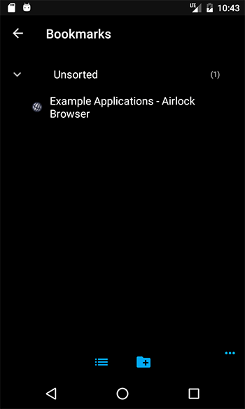<figcaption>Figure 18. Bookmarks screen</figcaption></figure>

To create a new bookmark, select *Add Bookmark* from the main screen's tab menu. The *Add to Bookmarks* dialog allows you to enter a name for the bookmark, which defaults to the page title. The URL is also editable.

You can choose to place the bookmark into an existing folder within the bookmarks screen, or leave the bookmark in the unsorted folder.

<figure>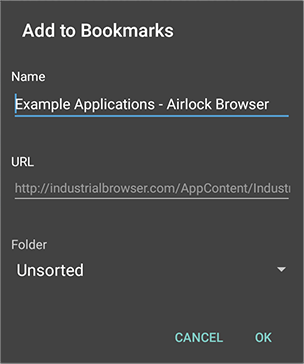<figcaption>Figure 19. Add to Bookmarks dialog</figcaption></figure>


