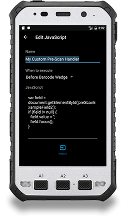
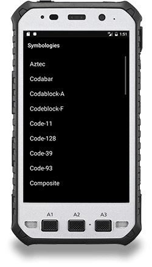
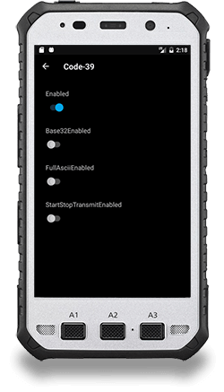
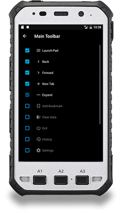
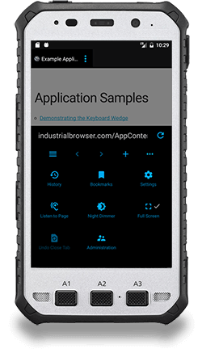
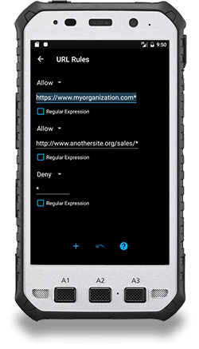
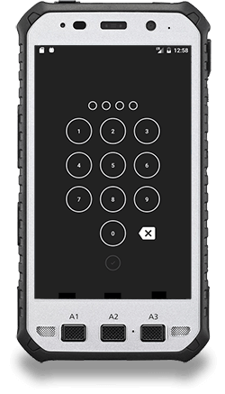
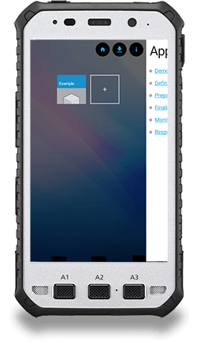

<section id="banner-3" class="section-padding" style="background:url(/images/airlock-bg.jpg) no-repeat 0 0; background-position:center; background-attachment:fixed;  background-size: cover; }">
  

    

	    

		    

			    

				    
					    
					    Airlock&nbsp;Browser
				    
			    

			    <h4 class="wow fadeInUp text-center hidden-xs">PRODUCTIVE MOBILE BROWSING</h4>
			    
<a href="Downloads/" class="btn btn-black btn-xl">Try it Now</a> &nbsp; <a href="../../RequestQuote/index.html?ProductId=IndustrialAndroid" class="btn btn-default btn-xl">Request A Quote</a>

		    

	    

    

  

</section>

<section id="faq-team" class="section-padding">
  

    

      

        <h2 class="text-left">Boost Productivity with a Modern Industrial Browser</h2>
        

        

          
            
 
				
Today, more and more organizations are choosing the web for delivering information and for line of business applications. 
				Rich user experiences can be delivered to devices without being coupled to any particular platform. 
				Yet, the question arises, how do you safely and securely allow end-users to consume web content from an enterprise device?

				
Airlock Browser provides secure browsing and allows organizations to configure the browser to meet the unique needs of their business and end-users. 
				Airlock Browser allows organizations to take advantage of mobile browsing without security risks, 
				while offering deep integration features that connect the web with the device, such as barcode scanning support for web pages.
              
            

         
           

              <ul class="wow fadeInUp">
                <li><a href="Downloads/">Download Airlock Browser for Android</a></li>
                <li><a href="UserGuides/V2/">User Guide</a></li>
				<li><a href="Scripting/V2/">Developer Resources</a></li>
              </ul>
            

        

      

      

        <h2 class="text-left">Airlock Browser at a glance</h2>
        

        

          

            

              

                <h4 class="panel-title"> <a class="accordion-toggle" data-toggle="collapse" data-parent="#accordion" href="#collapseOne">CORPORATE DEVICES</a> </h4>
              

              

                
For corporate-owned devices, you can restrict access to a predefined list of websites that may include only intranet sites or a list of external websites

              

            

            <!-- /.panel -->
            

              

                <h4 class="panel-title"> <a class="accordion-toggle" data-toggle="collapse" data-parent="#accordion" href="#collapseTwo">BARCODE SCANNER SUPPORT</a> </h4>
              

              

                
Airlock Browser provides hardware barcode scanner support out-of-the-box, allowing you to create rich web-based line of business applications that leverage your devices' barcode scanner. 
				Airlock Browser can populate fields with barcode data and has a JavaScript API for handling scanner events for more complex scenarios

              

            

            <!-- /.panel -->
            

              

                <h4 class="panel-title"> <a class="accordion-toggle" data-toggle="collapse" data-parent="#accordion" href="#collapseThree">FLEXIBLE CONFIGURATION</a> </h4>
              

              

                
Airlock Browser gives your organization the power to securely configure the browsing experience of end users. 
				You can deliver configuration settings to individual devices or groups of devices. Once Airlock Browser is configured, its settings can be exported and applied to other devices. 
				Moreover, settings can be applied over-the-air via the cloud and updated in real-time as your needs evolve.

              

            

            <!-- /.panel -->
            

              

                <h4 class="panel-title"> <a class="accordion-toggle" data-toggle="collapse" data-parent="#accordion" href="#collapseFour">LINE OF BUSINESS</a> </h4>
              

              

                
For line of business applications, administrators can enable kiosk mode to restrict navigation and browsing capabilities.

              

            

            <!-- /.panel --> 
          

        

      

    

  

</section>

<section id="services-1" class="section-padding-ash">
	

	  <h2 class="text-center">Top Features</h2>
	   

		

	 
                        
		

			
			

				

					

						<h3 class="media-heading">Client-Side Scripting</h3>
						Invoke custom JavaScript and CSS on a page.
						Also includes JavaScript events for barcodes, device battery, network connectivity, printing, and text to speech.                                
					

				

				
    
					

						<h3 class="media-heading">Restrict Browsing</h3>
                             Easily define URL rules to allow or deny access to URLs. (Also suppports regular expressions)  
					

				

				

					

						<h3 class="media-heading">Cloud Configuration</h3>
                        Configure multiple devices by deploying a configuration file to the cloud.       
					

				

				

					

						<h3 class="media-heading">Passcode Protection</h3>
						Protect the browser from unauthorized access by locking Airlock Browser with a passcode.
						Unlock via a fingerprint sensors is also supported, if present.
					

				

				

					

						<h3 class="media-heading">Swipable Tabs</h3>
						Swipe between tabs to work across multiple web application profiles.
					

				

				
			

			

				
				
				
				
				
				
				
				
			

			

				

					

						<h3 class="media-heading">Customizable Menus</h3>
						Add, remove, and reorder items depending on your organizations needs.
						Materialize only the features you want, and hide those you don't. 
					

				

				

					

						<h3 class="media-heading">Lockdown Mode</h3>
						Engage lock-down mode to restrict access to adminstration features.
					

				

				

					

						<h3 class="media-heading">Hardware Barcode Scanner</h3>
						Built in support for configuring a devices hardware barcode scanner.                                
					

				
	

				

					

						<h3 class="media-heading">Themeable</h3>
						Themable panoramic interface with a customizable background image, to reflect your organizations branding.                                
					

				
	

				

					

						<h3 class="media-heading">Multi-Language</h3>
						Operate in multiple regions? We've got you covered. Airlock is available in 25 languages.
					

				

			

		

	

</section>
	
<!-- About Section -->
<section class="section-padding">
    

        

            

                <h2>Other features include:</h2>
                  
            

        

        

            

                
				<ul class="feature-list list-unstyled wow fadeInUp">
					<li><i class="fa fa-check"></i>Configurable fullscreen or partial screen modes</li>
					<li><i class="fa fa-check"></i>Unlimited web profiles</li>
					<li><i class="fa fa-check"></i>Clear cookies and cache with history</li>
					<li><i class="fa fa-check"></i>Save and Share downloaded files</li>
					<li><i class="fa fa-check"></i>Ad Blocker</li>
					<li><i class="fa fa-check"></i>Restore browser tabs at launch</li>
					<li><i class="fa fa-check"></i>Define a custom user-agent</li>
					<li><i class="fa fa-check"></i>Save Passwords and Logins</li>
					<li><i class="fa fa-check"></i>Screen orientation controls</li>
					<li><i class="fa fa-check"></i>Set screen orientation web profile</li>            
				</ul>
            

            

            <ul class="feature-list list-unstyled wow fadeInUp">
				<li><i class="fa fa-check"></i>Printing Support</li>
				<li><i class="fa fa-check"></i>Searchable History</li>
				<li><i class="fa fa-check"></i>Bookmarks and bookmark folders</li>
				<li><i class="fa fa-check"></i>Set web page text size for each profile</li>
				<li><i class="fa fa-check"></i>Multiple search providers</li>
				<li><i class="fa fa-check"></i>Listen to pages with text-to-speech</li>
				<li><i class="fa fa-check"></i>Save images & open links via context menu</li>
				<li><i class="fa fa-check"></i>Find on Page</li>
				<li><i class="fa fa-check"></i>Night dimmer</li>
				<li><i class="fa fa-check"></i>And many more...</li>
        </ul>            
            

            

            

        

    

</section> 

