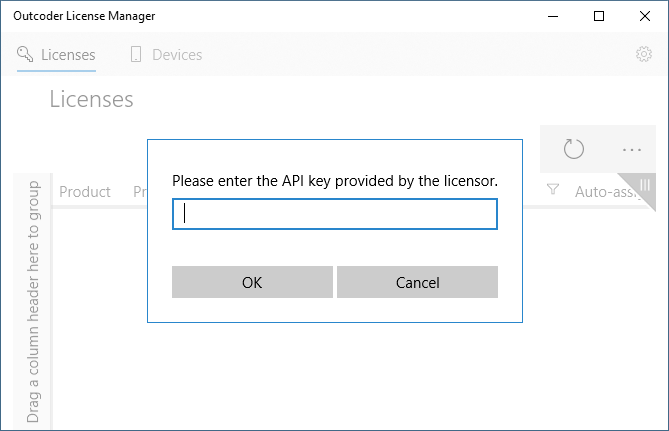
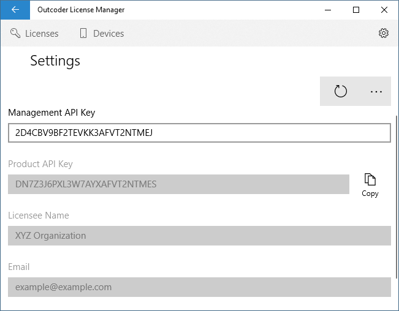
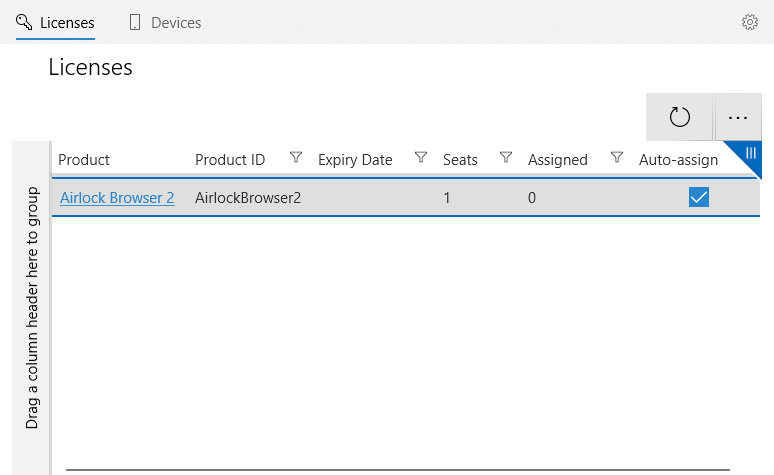
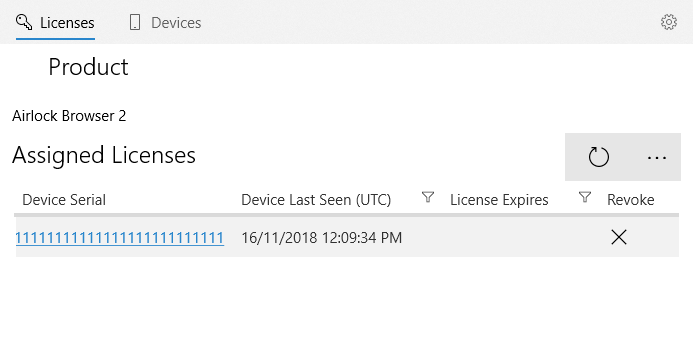
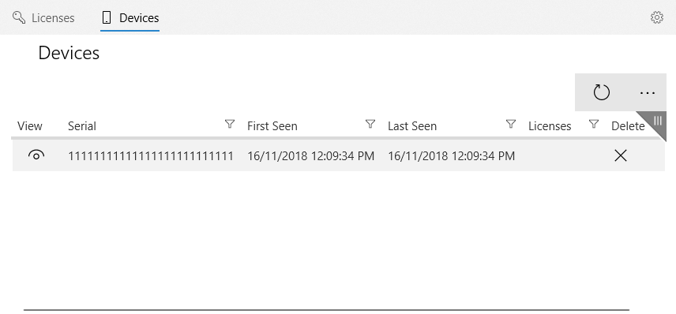

# Licium License Manager - User Guide

Outcoder's Licium License Manager (LLM) allows you to manage the software licenses used within your organization.

LLM requires Windows 10 Fall Creators Update (10.0; Build 17134)

You can [download LLM from the Windows Store](ms-windows-store://pdp/?productid=9PL94PP8R8HF).

Once licenses have been obtained from your vendor, you will also receive the following two keys:

* an Administration API key,
* and a Product API key.

When you first launch LLM, a dialog is presented requesting an API key. (See Figure 1.) This key is the Administration license key supplied by your vendor and enables the application to communicate with the license service.

> **NOTE:** The key is also configurable on the Settings screen. You can reach the Settings screen via the *cog* button on the top right of LLM.

<figure><figcaption>Figure 1. Entering the API key into the License Manager</figcaption></figure>

The *Product API Key* property is used by an application to identify itself as being part of your organization. (See Figure 2.) It is entered into an app (e.g., Airlock Browser) so that when the app talks to the licensing server, it can identify the organizational owner. All installations of an app within an organization will ordinarily share the same product API key.

To configure Airlock Browser's Product API Key setting, please see [License Server API Key](/Products/AirlockBrowser/UserGuides/V2/#license-server-api-key).

<figure><figcaption>Figure 2. The Settings screen</figcaption></figure>

Once a product is correctly configured with a License Server API key, you are able to assign, unassign, and re-assign licenses to the product via the *Licenses Screen*. (See Figure 3.)

The Licenses Screen allows you to view the available seats for a particular product. Ordinarily a seat can be assigned to a single device; one seat per device. The *Assigned* column shows how many seats have been assigned to devices. 

The *Auto-assign* field allows you to disable or enable the automatic assignment of licenses. If enabled, when an unlicensed device contacts the license service, it is automatically provisioned with a license. Disabling auto-assign requires that you manually assign licenses to individual devices using the Devices screen.

<figure><figcaption>Figure 3. The Licenses screen</figcaption></figure>

Clicking the Product hyperlink takes you to the *Product* screen. (See Figure 4.) The Product screen displays a list of devices that have been assigned a license for the product. You can revoke a license for a device by clicking the *Revoke* cross. This has the effect of freeing the license for assignment to another device.

<figure><figcaption>Figure 4. The Product screen</figcaption></figure>

The *Device* tab at the top of the application displays a list of known devices. (See Figure 5.) For each device you can see its serial number, when it first connected with the license service (First Seen), when it was last seen, and the number of license seats assigned to it. You can also delete a device, which revokes all active licenses for the device. 

> **NOTE:** Deleting a device removes it from the list and revokes any licenses assigned to it. It will, however, re-appear if it attempts to connect to the license service. To prevent a device that has been deleted from reappearing, use the *Ignore Device* option on the Device screen.

<figure><figcaption>Figure 5. The Devices screen</figcaption></figure>

Clicking the view button for a device allows you to see more detailed information for the device on the *Device* screen. (See Figure 6.)

A list of products are present in the *Assigned Licenses* section. An individual license can be assigned or unassigned to the device by checking or unchecking its *Assigned* property.

<figure><figcaption>Figure 6. The Device screen</figcaption></figure>