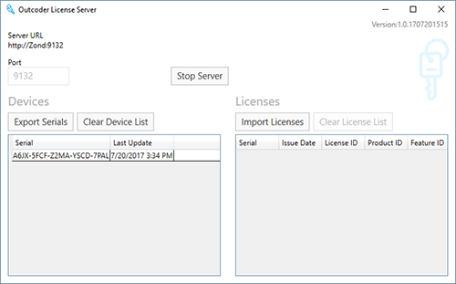
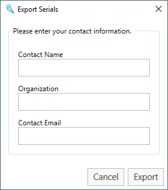
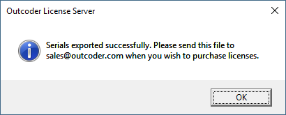
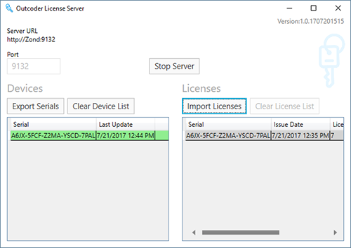

<style> @import url("../../../UserGuideCss/bootstrap_noprint.min.css"); </style>
<style> @import url("../../../UserGuideCss/font-awesome.min.css"); </style>
<style> @import url("../../../UserGuideCss/Theme.css"); </style>
<style> @import url("../../../UserGuideCss/UserGuide.css"); </style>
<style> @import url("../../../UserGuideCss/highlightjs/styles/github-gist.css"); </style>

# Outcoder License Server User Guide
#### For Version 1
----
## Table of Contents

[//]: # (TOC Begin)
* [Introduction](#introduction)
* [System Requirements](#system-requirements)
* [Overview of the User Interface](#overview-of-the-user-interface)
* [Exporting Serials](#exporting-serials)
* [Importing Licenses](#importing-licenses)

[//]: # (TOC End)

## Introduction

The Outcoder License Server provides an easy way to distribute licenses for Outcoder projects such as Airlock Browser. The License Server allows you to export serial numbers from devices on your network. The serial numbers can then be sent to sales@outcoder.com, where you'll be issued with a licenses file. You can then import the licenses file into the License Server, which will automatically distribute and assign licenses for devices on your network.  

## System Requirements

Outcoder License Server requires Windows 7 or later, the .NET Framework 4.6.1, and 6 MB of disk space.

## Overview of the User Interface

When you launch the License Server application, you are presented with the main window. (See Figure 1.)

By default the License Server listens for license requests on port **9132**. During installation, the installer attempts to open port 9132 on the system's firewall, and it adds a URL reservation for ```http://+:9132/```.

While the License Server is running, the Port number cannot be changed. To change the port number, click the *Stop Server* button. Click the *Start Server* button to resume the server.

When a device running a supported Outcoder product, such as Airlock Browser, connects to the License Server, the product's serial number is displayed in the *Devices* list on the left side of the main window. 

> **NOTE:** The License Server retains the list of devices that has connected to the License Server. To remove all items in the list, click *Clear Device List*.

<figure><figcaption>Figure 1. Main Window</figcaption></figure>

## Exporting Serials

When there exists at least one serial in the list, the *Export Serials* button is enabled. 

The Export Serials dialog has three required fields:
* Contact Name
* Organization
* Contact Email

(See Figure 2.)

Enter the information into the three fields and click export.

<figure><figcaption>Figure 2. Export Serials Dialog</figcaption></figure>

A *Choose Location* dialog is presented. Select the location where to save the serials XML file and click OK. The file is now ready to be sent to sales@outcoder.com or to a third party distributor or supplier. (See Figure 3.)

<figure><figcaption>Figure 3. Serials exported successfully dialog</figcaption></figure>

## Importing Licenses

Upon receipt of the Serials file, it is then processed and you will receive a licenses file.

Click the *Import License* button to browse for the license file. The license is displayed in the *Licenses* list on the right side of the main window. (See Figure 4.) 

When a device running a supported product, such as Airlock Browser, connects to the License Server, the device is sent the license. The item in the License Server's Devices list then changes to green, indicating that the device is licensed; and the corresponding item in the Licenses list changes to gray, indicating that the license has been applied.

<figure><figcaption>Figure 4. License imported and delivered to device.</figcaption></figure>

> **NOTE:** Clearing either the Devices or Licences lists does not affect the licensed state of any actual devices.


